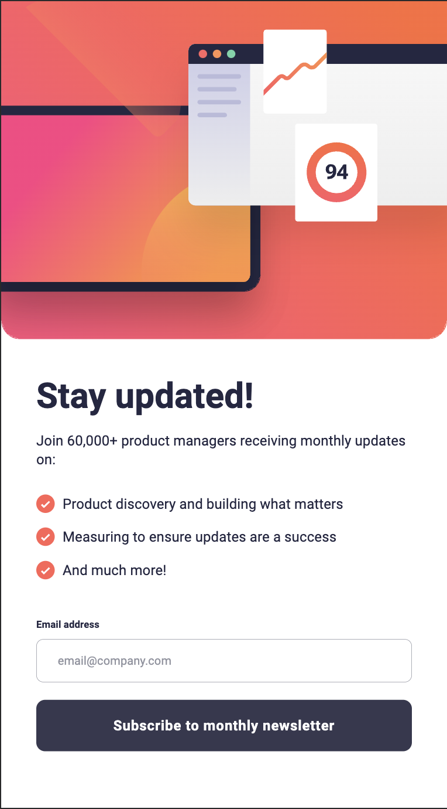
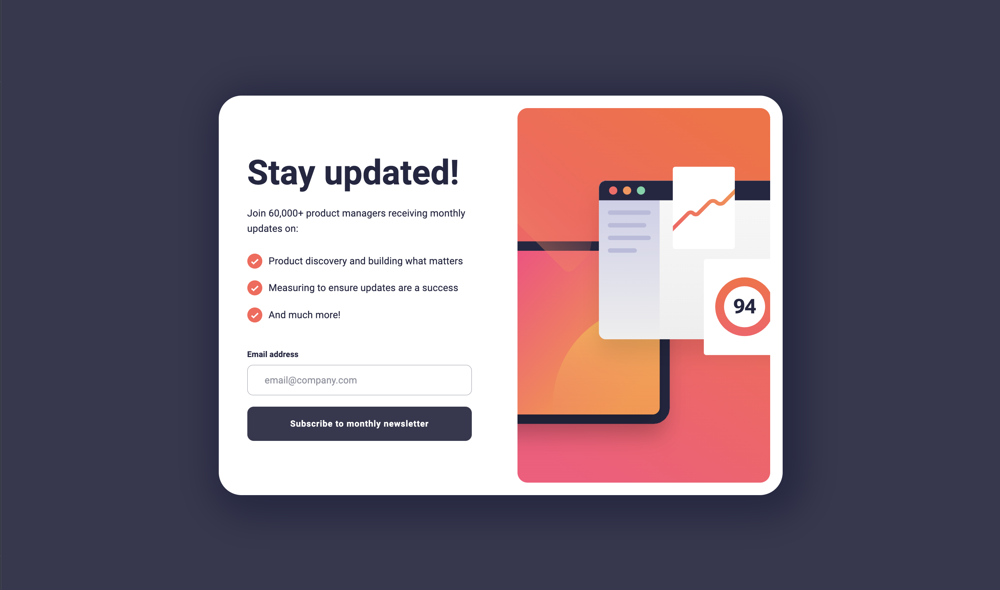

# Frontend Mentor - Product preview card component solution

This is a solution to the [Testimonials grid section challenge on Frontend Mentor](https://www.frontendmentor.io/challenges/testimonials-grid-section-Nnw6J7Un7). Frontend Mentor challenges help you improve your coding skills by building realistic projects.

## Table of contents

-   [Overview](#overview)
    -   [Screenshots](#screenshots)
    -   [Links](#links)
    -   [Built with](#built-with)
    -   [What I learned](#what-i-learned)
    -   [Continued development](#continued-development)
    -   [Useful resources](#useful-resources)
-   [Author](#author)
-   [Acknowledgments](#acknowledgments)

## Overview

### The challenge

Users should be able to:

-   View the optimal layout depending on their device's screen size
-   See hover and focus states for interactive elements

### Screenshots

Mobile Screenshot

Desktop Screenshot

### Links

-   [Solution URL](https://github.com/EtFX1/Frontend-mentor-Newsletter-Signup)
-   [Live Site URL](https://etfx1.github.io/Frontend-mentor-Newsletter-Signup/)

## My process

### Built with

-   Semantic HTML5 markup
-   CSS custom properties
-   Vanilla Javascript

### What I learned

I learned the fundamentals of css and responsiveness and also the basics of dom manipulation and email form validation

### Continued development

I want to learn how to use container queries.

### Useful resources

-   [Web Dev Simplified - Learn DOM Manipulation in 18 minutes](https://www.youtube.com/watch?v=y17RuWkWdn8&pp=ygUWd2ViIGRldiBzaW1wbGlmaWVkIGRvbQ%3D%3D) - Very concise and straight to the point video explaining the main methods needed for dom manipulation
-   [Web Dev Simplified - Learn JavaScript DOM Traversal In 15 Minutes](https://www.youtube.com/watch?v=v7rSSy8CaYE) - Very concise and straight to the point video explaining the main methods needed for dom traversal and getting elements from the dom

## Author

-   Frontend Mentor - [Frontendmentor@ETFX1](https://www.frontendmentor.io/profile/yourusername)
-   GitHub - [GitHub@EtFX1](https://github.com/EtFX1)

## Acknowledgments

My acknowledgements go to the people who created the content mentioned in [Useful resources](#useful-resources)
